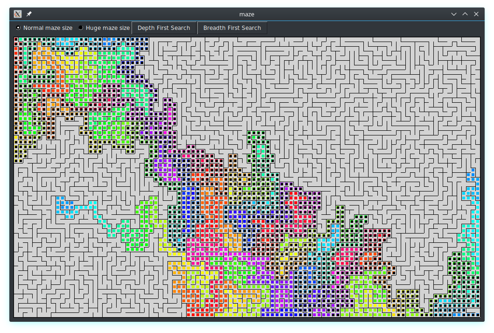

# Mazes

Experiments with generating and solving mazes, in Python.

For entertainment (animation) purposes, iterative algorithms are provided.

Currently available generators:

- Hunt and Kill
- Depth First

Currently available solvers:

- Depth First
- Breadth First

